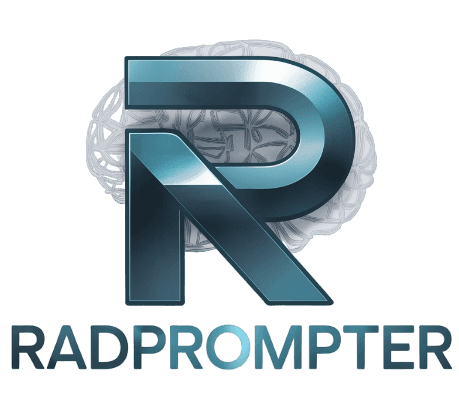

# RadPrompter

RadPrompter is a Python package for simplified and reproducible LLM prompting, particularly tailored for biomedical applications, including Radiology.

## Installation

You can install RadPrompter using pip:

```bash
pip install radprompter
```

## Getting Started

The core of RadPrompter is the `.toml` configuration file which defines your prompts. Here's a minimal example:

```toml
[METADATA]
version = 0.1
description = "A sample prompt for RadPrompter"

[CONSTRUCTOR]
system = "You are an experienced radiologist that help users extract infromation from radiology reports."
user = """Does the following report indicate a normal or abnormal finding?
{{report}}

Just reply with "normal" or "abnormal" to indicate your answer, without any additional information.
"""
```

And here's how you would use it in Python:

```python
from radprompter import Prompt, RadPrompter, vLLMClient

prompt = Prompt("sample.toml")

client = vLLMClient(
    model="meta-llama/Meta-Llama-3-8B-Instruct",
    base_url="http://localhost:9999/v1",
    temperature=0.0,
    seed=42
)

engine = RadPrompter(
    client=client,
    prompt=prompt, 
    output_file="output.csv",
)

reports = [{"report": "..."}]  # Your radiology reports
engine(reports)
```

For more details and advanced usage, check out our tutorials.

## Tutorials

| Tutorial                    | Description                                         | Notebook                                                                         |
|-----------------------------|-----------------------------------------------------|----------------------------------------------------------------------------------|
| 01_Basic-Usecase            | Covers the basic usage of RadPrompter               | [👁️](https://nbviewer.org/github/BardiaKh/RadPrompter/blob/main/tutorials/01_Basic-Usecase/01_Basic-Usecase.ipynb) [📓](./tutorials/01_Basic-Usecase)     |
| 02_RDP-Templating           | Introduces the `[PROMPTS]` section and `rdp` operator | [👁️](https://nbviewer.org/github/BardiaKh/RadPrompter/blob/main/tutorials/02_RDP-Templating/02_RDP-Templating.ipynb) [📓](./tutorials/02_RDP-Templating)    |
| 03_Multiturn-Prompting      | Demonstrates multi-turn prompting                   | [👁️](https://nbviewer.org/github/BardiaKh/RadPrompter/blob/main/tutorials/03_Multiturn-Prompting/03_Multiturn-Prompting.ipynb) [📓](./tutorials/03_Multiturn-Prompting) |
| 04_Using-Schemas            | Shows how to use schemas for structured output      | [👁️](https://nbviewer.org/github/BardiaKh/RadPrompter/blob/main/tutorials/04_Using-Schemas/04_Using-Schemas.ipynb) [📓](./tutorials/04_Using-Schemas)     |
| 05_JSON-Prefill        | Covers using JSON prefills and sanitization                     | [👁️](https://nbviewer.org/github/BardiaKh/RadPrompter/blob/main/tutorials/05_JSON-Prefill/05_JSON-Prefill.ipynb) [📓](./tutorials/05_JSON-Prefill)  |
| 06_HuggingFace-Client        | Covers using the new `HuggingFaceClient`                     | [👁️](https://nbviewer.org/github/BardiaKh/RadPrompter/blob/main/tutorials/06_HuggingFace-Client/06_HuggingFace-Client.ipynb) [📓](./tutorials/06_HuggingFace-Client)  |

## Contributing

We welcome contributions! If you have any updates or improvements to the package, please open an issue or submit a pull request. We're happy to review and incorporate your changes.

## Authors

RadPrompter is created and maintained by:
- Bardia Khosravi (bardiakhosravi95@gmail.com)
- Theo Dapamede (theo.dapamede@emory.edu)
